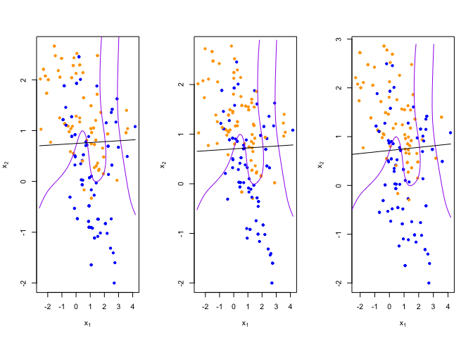

Homework 1
================
Oscar Yu
January 19, 2020

``` r
library('class')
library('dplyr')
```

    ## 
    ## Attaching package: 'dplyr'

    ## The following objects are masked from 'package:stats':
    ## 
    ##     filter, lag

    ## The following objects are masked from 'package:base':
    ## 
    ##     intersect, setdiff, setequal, union

``` r
## load binary classification example data from author website 
## 'ElemStatLearn' package no longer available
load(url('https://web.stanford.edu/~hastie/ElemStatLearn/datasets/ESL.mixture.rda'))
dat <- ESL.mixture

plot_mix_data <- function(dat, datboot=NULL) {
  if(!is.null(datboot)) {
    dat$x <- datboot$x
    dat$y <- datboot$y
  }
  plot(dat$x[,1], dat$x[,2],
       col=ifelse(dat$y==0, 'blue', 'orange'),
       pch=20,
       xlab=expression(x[1]),
       ylab=expression(x[2]))
  ## draw Bayes (True) classification boundary
  prob <- matrix(dat$prob, length(dat$px1), length(dat$px2))
  cont <- contourLines(dat$px1, dat$px2, prob, levels=0.5)
  rslt <- sapply(cont, lines, col='purple')
}

plot_mix_data(dat)
```

<!-- -->

Re-write the functions fit_lc and predict_lc using lm, and the
associated predict method for lm objects.

``` r
## fit linear classifier
fit_lc <- function(y, x) {
  beta <- lm(y ~ x1+x2, x)
}

## make predictions from linear classifier
predict_lc <- function(x, beta) {
  predict(beta, new = x)
}

## fit model to mixture data and make predictions
lc_beta <- fit_lc(dat$y, data.frame(x1 = dat$x[,1], x2 = dat$x[,2]))
lc_pred <- predict_lc( data.frame(x1 = dat$xnew[,1], x2 = dat$xnew[,2]),lc_beta)

## reshape predictions as a matrix
lc_pred <- matrix(lc_pred, length(dat$px1), length(dat$px2))
contour(lc_pred,
      xlab=expression(x[1]),
      ylab=expression(x[2]))
```

<!-- -->

``` r
## find the contours in 2D space such that lc_pred == 0.5
lc_cont <- contourLines(dat$px1, dat$px2, lc_pred, levels=0.5)

## plot data and decision surface
plot_mix_data(dat)
sapply(lc_cont, lines)
```

<!-- -->

    ## [[1]]
    ## NULL

``` r
## do bootstrap to get a sense of variance in decision surface
resample <- function(dat) {
  idx <- sample(1:length(dat$y), replace = T)
  dat$y <- dat$y[idx]
  dat$x <- dat$x[idx,]
  return(dat)
}
  
## plot linear classifier for three bootstraps
par(mfrow=c(1,3))
for(b in 1:3) {
  datb <- resample(dat)
  ## fit model to mixture data and make predictions
  lc_beta <- fit_lc(datb$y, data.frame(x1 = datb$x[,1], x2 = datb$x[,2]))
  lc_pred <- predict_lc( data.frame(x1 = datb$xnew[,1], x2 = datb$xnew[,2]), lc_beta)
  
  ## reshape predictions as a matrix
  lc_pred <- matrix(lc_pred, length(datb$px1), length(datb$px2))

  ## find the contours in 2D space such that lc_pred == 0.5
  lc_cont <- contourLines(datb$px1, datb$px2, lc_pred, levels=0.5)
  
  ## plot data and decision surface
  plot_mix_data(dat, datb)
  sapply(lc_cont, lines)
}
```

<!-- -->

Consider making the linear classifier more flexible, by adding squared
terms for x1 and x2 to the linear model

``` r
## fit linear classifier
fit_lc <- function(y, x) {
  beta <- lm(y ~ x1+x2+I(x2^2)+I(x1^2), x)
}

## make predictions from linear classifier
predict_lc <- function(x, beta) {
  predict(beta, new = x)
}

## fit model to mixture data and make predictions
lc_beta <- fit_lc(dat$y, data.frame(x1 = dat$x[,1], x2 = dat$x[,2]))
lc_pred <- predict_lc( data.frame(x1 = dat$xnew[,1], x2 = dat$xnew[,2]),lc_beta)

## reshape predictions as a matrix
lc_pred <- matrix(lc_pred, length(dat$px1), length(dat$px2))
contour(lc_pred,
      xlab=expression(x[1]),
      ylab=expression(x[2]))
```

<!-- -->

``` r
## find the contours in 2D space such that lc_pred == 0.5
lc_cont <- contourLines(dat$px1, dat$px2, lc_pred, levels=0.5)

## plot data and decision surface
plot_mix_data(dat)
sapply(lc_cont, lines)
```

<!-- -->

    ## [[1]]
    ## NULL

``` r
## do bootstrap to get a sense of variance in decision surface
resample <- function(dat) {
  idx <- sample(1:length(dat$y), replace = T)
  dat$y <- dat$y[idx]
  dat$x <- dat$x[idx,]
  return(dat)
}
  
## plot linear classifier for three bootstraps
par(mfrow=c(1,3))
for(b in 1:3) {
  datb <- resample(dat)
  ## fit model to mixture data and make predictions
  lc_beta <- fit_lc(datb$y, data.frame(x1 = datb$x[,1], x2 = datb$x[,2]))
  lc_pred <- predict_lc( data.frame(x1 = datb$xnew[,1], x2 = datb$xnew[,2]), lc_beta)
  
  ## reshape predictions as a matrix
  lc_pred <- matrix(lc_pred, length(datb$px1), length(datb$px2))

  ## find the contours in 2D space such that lc_pred == 0.5
  lc_cont <- contourLines(datb$px1, datb$px2, lc_pred, levels=0.5)
  
  ## plot data and decision surface
  plot_mix_data(dat, datb)
  sapply(lc_cont, lines)
}
```

<!-- -->

Describe how this more flexible model affects the bias-variance tradeoff

More flexible model will result in lower bias and higher variance. The
approximation line of the model is more sensitive to the data and better
at predicting the true class. Better prediction results in lower bias
and higher sensitivity means higher variance.
