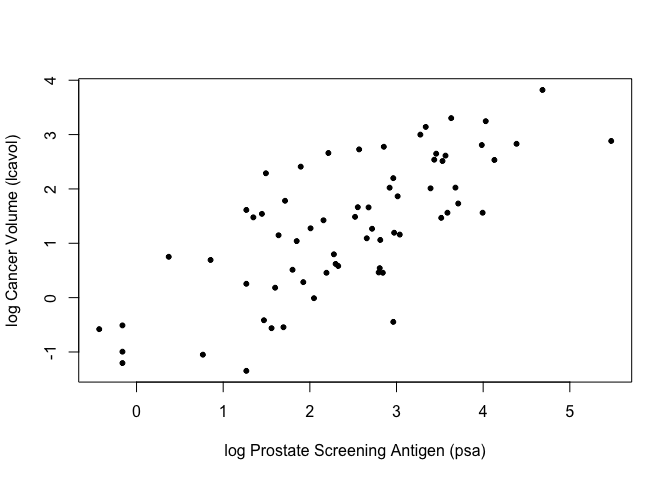
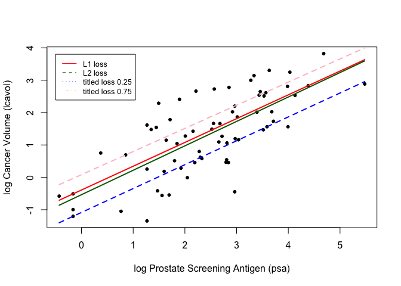
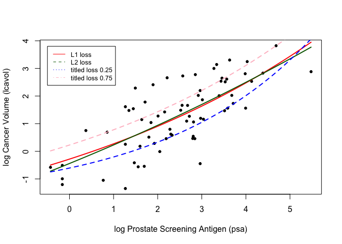

Homework 2
================
Oscar Yu
January 31, 2020

``` r
## load prostate data
prostate <- 
  read.table(url(
    'https://web.stanford.edu/~hastie/ElemStatLearn/datasets/prostate.data'))

## subset to training examples
prostate_train <- subset(prostate, train==TRUE)

## plot lcavol vs lpsa
plot_psa_data <- function(dat=prostate_train) {
  plot(dat$lpsa, dat$lcavol,
       xlab="log Prostate Screening Antigen (psa)",
       ylab="log Cancer Volume (lcavol)",
       pch = 20)
}
plot_psa_data()
```

<!-- -->

``` r
############################
## different linear regression
############################

## L1 loss function
L1_loss <- function(y, yhat)
  abs(y-yhat)

## tilted 0.25 function
titled25_loss <- function(y, yhat)
  qrnn::tilted.abs(y-yhat, 0.25)

## tilted 0.75 loss function
titled75_loss <- function(y, yhat)
  qrnn::tilted.abs(y-yhat, 0.75)

## L2 loss function
L2_loss <- function(y, yhat)
  (y-yhat)^2

## fit simple linear model using numerical optimization
fit_lin_L1 <- function(y, x, loss=L1_loss, beta_init = c(-0.51, 0.75)) {
  err <- function(beta)
    mean(loss(y,  beta[1] + beta[2]*x))
  beta <- optim(par = beta_init, fn = err)
  return(beta)
}

## fit simple linear model using numerical optimization
fit_lin <- function(y, x, loss=L2_loss, beta_init = c(-0.51, 0.75)) {
  err <- function(beta)
    mean(loss(y,  beta[1] + beta[2]*x))
  beta <- optim(par = beta_init, fn = err)
  return(beta)
}

## make predictions from linear model
predict_lin <- function(x, beta)
  beta[1] + beta[2]*x

## fit linear model
lin_beta_L1 <- fit_lin_L1(y=prostate_train$lcavol,
                    x=prostate_train$lpsa,
                    loss=L1_loss)

## compute predictions for a grid of inputs
x_grid <- seq(min(prostate_train$lpsa),
              max(prostate_train$lpsa),
              length.out=100)

lin_pred_L1 <- predict_lin(x=x_grid, beta=lin_beta_L1$par)

## fit linear model
lin_beta_L2 <- fit_lin(y=prostate_train$lcavol,
                    x=prostate_train$lpsa,
                    loss=L2_loss)

## compute predictions for a grid of inputs
x_grid <- seq(min(prostate_train$lpsa),
              max(prostate_train$lpsa),
              length.out=100)
lin_pred_L2 <- predict_lin(x=x_grid, beta=lin_beta_L2$par)

## fit linear model with custom loss
lin_beta_tilted25 <- fit_lin(y=prostate_train$lcavol,
                    x=prostate_train$lpsa,
                    loss=titled25_loss)

lin_pred_titled25 <- predict_lin(x=x_grid, beta=lin_beta_tilted25$par)

## fit linear model with custom loss
lin_beta_tilted75 <- fit_lin(y=prostate_train$lcavol,
                    x=prostate_train$lpsa,
                    loss=titled75_loss)

lin_pred_titled75 <- predict_lin(x=x_grid, beta=lin_beta_tilted75$par)

## plot data
plot_psa_data()

## plot predictions from L1 loss
lines(x=x_grid, y=lin_pred_L1, col='red', lwd=2)

## plot predictions from L2 loss
lines(x=x_grid, y=lin_pred_L2, col='darkgreen', lwd=2)

## plot predictions from custom loss
lines(x=x_grid, y=lin_pred_titled25, col='blue', lwd=2, lty=2)

## plot predictions from custom loss
lines(x=x_grid, y=lin_pred_titled75, col='pink', lwd=2, lty=2)

legend(-0.5,3.8,legend = c("L1 loss", "L2 loss", "titled loss 0.25", "titled loss 0.75"), 
       col = c('red','darkgreen','blue','pink'), lty = 1:4, cex=0.8)
```

<!-- -->

``` r
## fit simple nonlinear model using numerical optimization
fit_lin_L1 <- function(y, x, loss=L1_loss, beta_init = c(-1.0, 0.0, -0.3) ) {
  err <- function(beta)
    mean(loss(y,  beta[1] + beta[2]*exp(-beta[3]*x)))
  beta <- optim(par = beta_init, fn = err)
  return(beta)
}

## fit simple nonlinear model using numerical optimization
fit_lin <- function(y, x, loss=L2_loss, beta_init = c(-1.0, 0.0, -0.3) ) {
  err <- function(beta)
    mean(loss(y,  beta[1] + beta[2]*exp(-beta[3]*x)))
  beta <- optim(par = beta_init, fn = err)
  return(beta)
}

## make predictions from nonlinear model
predict_lin <- function(x, beta)
  beta[1] + beta[2]*exp(-beta[3]*x)
                        
## fit nonlinear model
lin_beta_L1 <- fit_lin_L1(y=prostate_train$lcavol,
                    x=prostate_train$lpsa,
                    loss=L1_loss)

## compute predictions for a grid of inputs
x_grid <- seq(min(prostate_train$lpsa),
              max(prostate_train$lpsa),
              length.out=100)

lin_pred_L1 <- predict_lin(x=x_grid, beta=lin_beta_L1$par)

## fit linear model
lin_beta_L2 <- fit_lin(y=prostate_train$lcavol,
                    x=prostate_train$lpsa,
                    loss=L2_loss)

## compute predictions for a grid of inputs
x_grid <- seq(min(prostate_train$lpsa),
              max(prostate_train$lpsa),
              length.out=100)
lin_pred_L2 <- predict_lin(x=x_grid, beta=lin_beta_L2$par)

## fit linear model with custom loss
lin_beta_tilted25 <- fit_lin(y=prostate_train$lcavol,
                    x=prostate_train$lpsa,
                    loss=titled25_loss)

lin_pred_titled25 <- predict_lin(x=x_grid, beta=lin_beta_tilted25$par)

## fit linear model with custom loss
lin_beta_tilted75 <- fit_lin(y=prostate_train$lcavol,
                    x=prostate_train$lpsa,
                    loss=titled75_loss)

lin_pred_titled75 <- predict_lin(x=x_grid, beta=lin_beta_tilted75$par)

## plot data
plot_psa_data()

## plot predictions from L1 loss
lines(x=x_grid, y=lin_pred_L1, col='red', lwd=2)

## plot predictions from L2 loss
lines(x=x_grid, y=lin_pred_L2, col='darkgreen', lwd=2)

## plot predictions from custom loss
lines(x=x_grid, y=lin_pred_titled25, col='blue', lwd=2, lty=2)

## plot predictions from custom loss
lines(x=x_grid, y=lin_pred_titled75, col='pink', lwd=2, lty=2)

legend(-0.5,3.8,legend = c("L1 loss", "L2 loss", "titled loss 0.25", "titled loss 0.75"), 
       col = c('red','darkgreen','blue','pink'), lty = 1:4, cex=0.8)
```

<!-- -->
