Homework4-oscar
================
2023-02-23

``` r
library('MASS') ## for 'mcycle'
library('manipulate') ## for 'manipulate'

y <- mcycle$accel
x <- matrix(mcycle$times, length(mcycle$times), 1)

set.seed(123) # Set seed for reproducibility
train_indices <- sample(nrow(x), floor(0.75 * nrow(x)))
train_x <- matrix(x[train_indices, ],length(x[train_indices, ]),1)
test_x <- matrix(x[-train_indices, ],length(x[-train_indices, ]),1)

train_y <- matrix(y[train_indices],length(y[train_indices]),1)
test_y <- matrix(y[-train_indices],length(y[-train_indices]),1)
```

``` r
## Epanechnikov kernel function
## x  - n x p matrix of training inputs
## x0 - 1 x p input where to make prediction
## lambda - bandwidth (neighborhood size)
kernel_epanechnikov <- function(x, x0, lambda=1) {
  d <- function(t)
    ifelse(t <= 1, 3/4*(1-t^2), 0)
  z <- t(t(x) - x0)
  d(sqrt(rowSums(z*z))/lambda)
}

## k-NN kernel function
## x  - n x p matrix of training inputs
## x0 - 1 x p input where to make prediction
## k  - number of nearest neighbors
kernel_k_nearest_neighbors <- function(x, x0, k=1) {
  ## compute distance betwen each x and x0
  z <- t(t(x) - x0)
  d <- sqrt(rowSums(z*z))

  ## initialize kernel weights to zero
  w <- rep(0, length(d))
  
  ## set weight to 1 for k nearest neighbors
  w[order(d)[1:k]] <- 1
  
  return(w)
}

## Make predictions using the NW method
## y  - n x 1 vector of training outputs
## x  - n x p matrix of training inputs
## x0 - m x p matrix where to make predictions
## kern  - kernel function to use
## ... - arguments to pass to kernel function
nadaraya_watson <- function(y, x, x0, kern, ...) {
  k <- t(apply(x0, 1, function(x0_) {
    k_ <- kern(x, x0_, ...)
    k_/sum(k_)
  }))
  yhat <- drop(k %*% y)
  attr(yhat, 'k') <- k
  return(yhat)
}

## Helper function to view kernel (smoother) matrix
matrix_image <- function(x) {
  rot <- function(x) t(apply(x, 2, rev))
  cls <- rev(gray.colors(20, end=1))
  image(rot(x), col=cls, axes=FALSE)
  xlb <- pretty(1:ncol(x))
  xat <- (xlb-0.5)/ncol(x)
  ylb <- pretty(1:nrow(x))
  yat <- (ylb-0.5)/nrow(x)
  axis(3, at=xat, labels=xlb)
  axis(2, at=yat, labels=ylb)
  mtext('Rows', 2, 3)
  mtext('Columns', 3, 3)
}

## Compute effective df using NW method
## y  - n x 1 vector of training outputs
## x  - n x p matrix of training inputs
## kern  - kernel function to use
## ... - arguments to pass to kernel function
effective_df <- function(y, x, kern, ...) {
  y_hat <- nadaraya_watson(y, x, x,
    kern=kern, ...)
  sum(diag(attr(y_hat, 'k')))
}

## loss function
## y    - train/test y
## yhat - predictions at train/test x
loss_squared_error <- function(y, yhat)
  (y - yhat)^2

## test/train error
## y    - train/test y
## yhat - predictions at train/test x
## loss - loss function
error <- function(y, yhat, loss=loss_squared_error)
  mean(loss(y, yhat))

## AIC
## y    - training y
## yhat - predictions at training x
## d    - effective degrees of freedom
aic <- function(y, yhat, d)
  error(y, yhat) + 2/length(y)*d

## BIC
## y    - training y
## yhat - predictions at training x
## d    - effective degrees of freedom
bic <- function(y, yhat, d)
  error(y, yhat) + log(length(y))/length(y)*d


## make predictions using NW method at training inputs
y_hat <- nadaraya_watson(y, x, x,
  kernel_epanechnikov, lambda=5)

## compute effective degrees of freedom
edf <- effective_df(y, x, kernel_epanechnikov, lambda=5)

## create a grid of inputs 
x_plot <- matrix(seq(min(x),max(x),length.out=100),100,1)

## make predictions using NW method at each of grid points
y_hat_plot <- nadaraya_watson(y, x, x_plot,
  kernel_epanechnikov, lambda=1)

# how does k affect shape of predictor and eff. df using k-nn kernel ?
for (k_slider in 1:10) {
  ## make predictions using NW method at training inputs
  y_hat <- nadaraya_watson(y, x, x,
    kern=kernel_k_nearest_neighbors, k=k_slider)
  edf <- effective_df(y, x,
    kern=kernel_k_nearest_neighbors, k=k_slider)
  aic_ <- aic(y, y_hat, edf)
  bic_ <- bic(y, y_hat, edf)
  y_hat_plot <- nadaraya_watson(y, x, x_plot,
    kern=kernel_k_nearest_neighbors, k=k_slider)
  plot(x, y, xlab="Time (ms)", ylab="Acceleration (g)")
  legend('topright', legend = c(
    paste0('eff. df = ', round(edf,1)),
    paste0('aic = ', round(aic_, 1)),
    paste0('bic = ', round(bic_, 1))),
    bty='n')
  title(paste("K = " , k_slider))
  lines(x_plot, y_hat_plot, col="#882255", lwd=2)
}
```

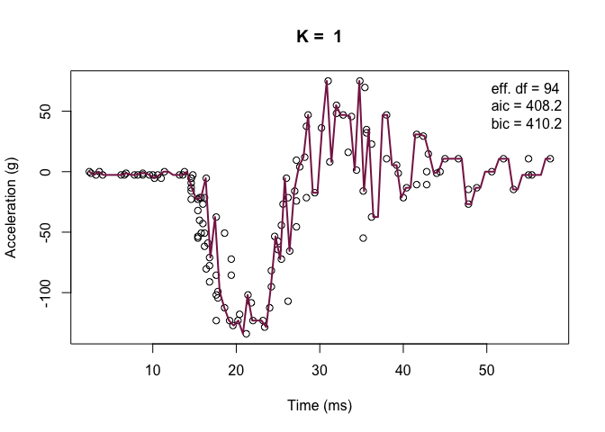<!-- -->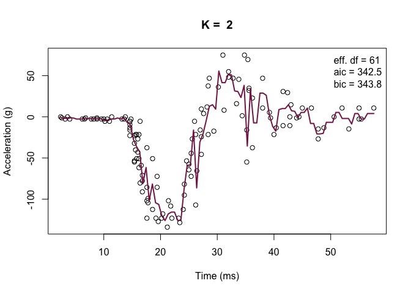<!-- -->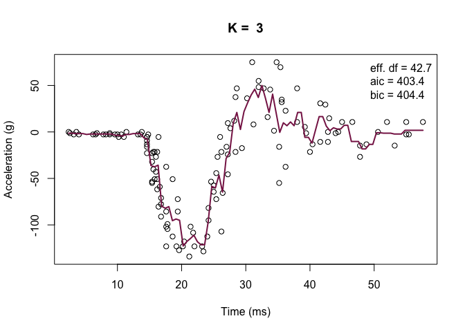<!-- -->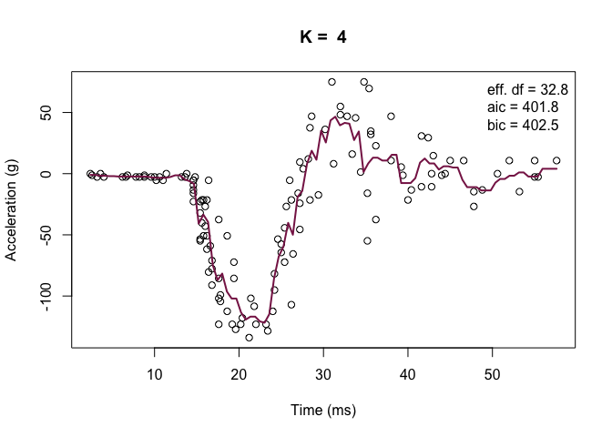<!-- -->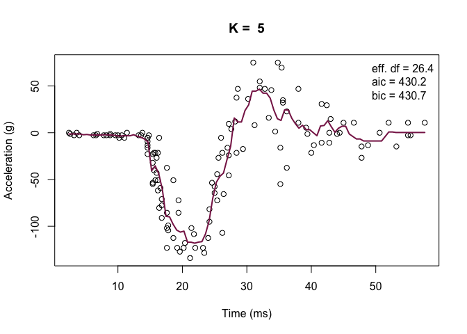<!-- -->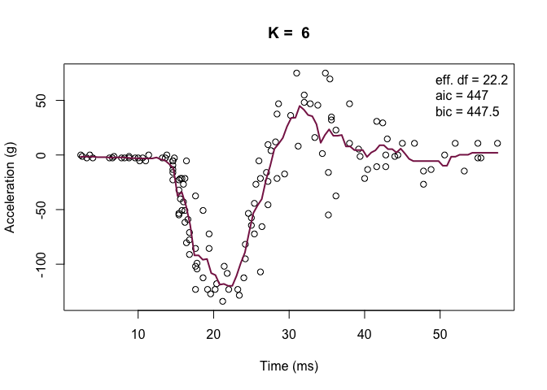<!-- -->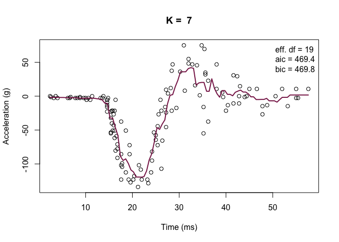<!-- --><!-- -->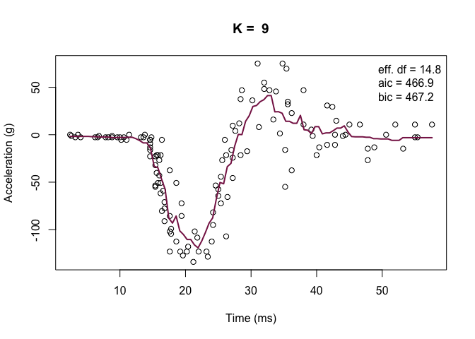<!-- -->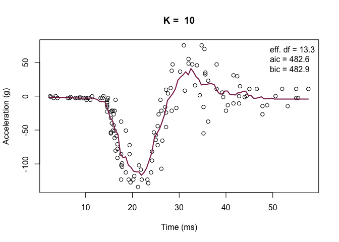<!-- -->

``` r
k_seq = seq(1,20, 1)
train_err = rep(0,20)
aic_err = rep(0,20)
bic_err = rep(0,20)
edf = rep(0, 20)
validation_err = rep(0,20)

 for (i in k_seq) {
  y_hat <- nadaraya_watson(train_y, train_x, train_x,
    kern=kernel_k_nearest_neighbors, k=i)
  train_err[i] <- error(train_y, y_hat, loss=loss_squared_error)
  edf[i] <- effective_df(train_y, train_x, kern=kernel_k_nearest_neighbors, k=i)
  aic_err[i] <- aic(train_y, y_hat, edf)
  bic_err[i] <- bic(train_y, y_hat, edf)
  y_hat_vali <- nadaraya_watson(train_y, train_x, test_x,
    kern=kernel_k_nearest_neighbors, k=i)
  validation_err[i] <- error(test_y, y_hat_vali, loss=loss_squared_error)
 }
```

    ## Warning in aic_err[i] <- aic(train_y, y_hat, edf): number of items to replace is
    ## not a multiple of replacement length

    ## Warning in bic_err[i] <- bic(train_y, y_hat, edf): number of items to replace is
    ## not a multiple of replacement length

    ## Warning in aic_err[i] <- aic(train_y, y_hat, edf): number of items to replace is
    ## not a multiple of replacement length

    ## Warning in bic_err[i] <- bic(train_y, y_hat, edf): number of items to replace is
    ## not a multiple of replacement length

    ## Warning in aic_err[i] <- aic(train_y, y_hat, edf): number of items to replace is
    ## not a multiple of replacement length

    ## Warning in bic_err[i] <- bic(train_y, y_hat, edf): number of items to replace is
    ## not a multiple of replacement length

    ## Warning in aic_err[i] <- aic(train_y, y_hat, edf): number of items to replace is
    ## not a multiple of replacement length

    ## Warning in bic_err[i] <- bic(train_y, y_hat, edf): number of items to replace is
    ## not a multiple of replacement length

    ## Warning in aic_err[i] <- aic(train_y, y_hat, edf): number of items to replace is
    ## not a multiple of replacement length

    ## Warning in bic_err[i] <- bic(train_y, y_hat, edf): number of items to replace is
    ## not a multiple of replacement length

    ## Warning in aic_err[i] <- aic(train_y, y_hat, edf): number of items to replace is
    ## not a multiple of replacement length

    ## Warning in bic_err[i] <- bic(train_y, y_hat, edf): number of items to replace is
    ## not a multiple of replacement length

    ## Warning in aic_err[i] <- aic(train_y, y_hat, edf): number of items to replace is
    ## not a multiple of replacement length

    ## Warning in bic_err[i] <- bic(train_y, y_hat, edf): number of items to replace is
    ## not a multiple of replacement length

    ## Warning in aic_err[i] <- aic(train_y, y_hat, edf): number of items to replace is
    ## not a multiple of replacement length

    ## Warning in bic_err[i] <- bic(train_y, y_hat, edf): number of items to replace is
    ## not a multiple of replacement length

    ## Warning in aic_err[i] <- aic(train_y, y_hat, edf): number of items to replace is
    ## not a multiple of replacement length

    ## Warning in bic_err[i] <- bic(train_y, y_hat, edf): number of items to replace is
    ## not a multiple of replacement length

    ## Warning in aic_err[i] <- aic(train_y, y_hat, edf): number of items to replace is
    ## not a multiple of replacement length

    ## Warning in bic_err[i] <- bic(train_y, y_hat, edf): number of items to replace is
    ## not a multiple of replacement length

    ## Warning in aic_err[i] <- aic(train_y, y_hat, edf): number of items to replace is
    ## not a multiple of replacement length

    ## Warning in bic_err[i] <- bic(train_y, y_hat, edf): number of items to replace is
    ## not a multiple of replacement length

    ## Warning in aic_err[i] <- aic(train_y, y_hat, edf): number of items to replace is
    ## not a multiple of replacement length

    ## Warning in bic_err[i] <- bic(train_y, y_hat, edf): number of items to replace is
    ## not a multiple of replacement length

    ## Warning in aic_err[i] <- aic(train_y, y_hat, edf): number of items to replace is
    ## not a multiple of replacement length

    ## Warning in bic_err[i] <- bic(train_y, y_hat, edf): number of items to replace is
    ## not a multiple of replacement length

    ## Warning in aic_err[i] <- aic(train_y, y_hat, edf): number of items to replace is
    ## not a multiple of replacement length

    ## Warning in bic_err[i] <- bic(train_y, y_hat, edf): number of items to replace is
    ## not a multiple of replacement length

    ## Warning in aic_err[i] <- aic(train_y, y_hat, edf): number of items to replace is
    ## not a multiple of replacement length

    ## Warning in bic_err[i] <- bic(train_y, y_hat, edf): number of items to replace is
    ## not a multiple of replacement length

    ## Warning in aic_err[i] <- aic(train_y, y_hat, edf): number of items to replace is
    ## not a multiple of replacement length

    ## Warning in bic_err[i] <- bic(train_y, y_hat, edf): number of items to replace is
    ## not a multiple of replacement length

    ## Warning in aic_err[i] <- aic(train_y, y_hat, edf): number of items to replace is
    ## not a multiple of replacement length

    ## Warning in bic_err[i] <- bic(train_y, y_hat, edf): number of items to replace is
    ## not a multiple of replacement length

    ## Warning in aic_err[i] <- aic(train_y, y_hat, edf): number of items to replace is
    ## not a multiple of replacement length

    ## Warning in bic_err[i] <- bic(train_y, y_hat, edf): number of items to replace is
    ## not a multiple of replacement length

    ## Warning in aic_err[i] <- aic(train_y, y_hat, edf): number of items to replace is
    ## not a multiple of replacement length

    ## Warning in bic_err[i] <- bic(train_y, y_hat, edf): number of items to replace is
    ## not a multiple of replacement length

    ## Warning in aic_err[i] <- aic(train_y, y_hat, edf): number of items to replace is
    ## not a multiple of replacement length

    ## Warning in bic_err[i] <- bic(train_y, y_hat, edf): number of items to replace is
    ## not a multiple of replacement length

``` r
df <- data.frame(k = k_seq, train_err=train_err, train_err =train_err, aic=aic_err, bic=bic_err, vali_err=validation_err)


library(ggplot2)
ggplot(df, aes(x = k)) +
  geom_line(aes(y = train_err, color = "train_err")) +
  geom_line(aes(y = aic_err, color = "aic_err")) +
  geom_line(aes(y = bic_err, color = "bic_err")) +
  geom_line(aes(y = vali_err, color = "vali_err")) +
  scale_color_manual(values = c("red",  "pink","blue","yellow"),
                     labels = c("train_err","aic_err","bic_err", "vali_err"))+
  labs(x = "K", y = "err", title = "Errors")+
  theme_minimal()
```

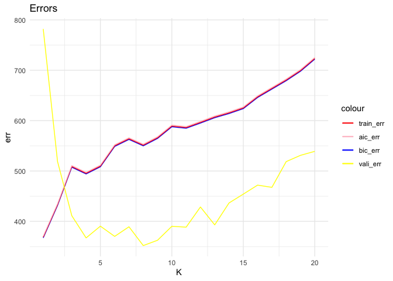<!-- -->

``` r
library('manipulate')
library('splines') ## 'ns'
library('caret') ## 'knnreg' and 'createFolds'
```

    ## Loading required package: lattice

``` r
## 5-fold cross-validation of knnreg model
## create five folds
set.seed(1985)
inc_flds  <- createFolds(mcycle$times, k=5)
#print(inc_flds)
#sapply(inc_flds, length)  ## not all the same length

cvknnreg <- function(kNN = 10, flds=inc_flds) {
  cverr <- rep(NA, length(flds))
  for(tst_idx in 1:length(flds)) { ## for each fold
    
    ## get training and testing data
    inc_trn <- mcycle[-flds[[tst_idx]],]
    inc_tst <- mcycle[ flds[[tst_idx]],]
    
    ## fit kNN model to training data
    knn_fit <- knnreg(times ~ accel,
                      k=kNN, data=inc_trn)
    
    ## compute test error on testing data
    pre_tst <- predict(knn_fit, inc_tst)
    cverr[tst_idx] <- mean((inc_tst$times - pre_tst)^2)
  }
  return(cverr)
}

## Compute 5-fold CV for kNN = 1:20
cverrs <- sapply(1:20, cvknnreg)
#print(cverrs) ## rows are k-folds (1:5), cols are kNN (1:20)
cverrs_mean <- apply(cverrs, 2, mean)
cverrs_sd   <- apply(cverrs, 2, sd)

## Plot the results of 5-fold CV for kNN = 1:20
plot(x=1:20, y=cverrs_mean, 
     ylim=range(cverrs),
     xlab="'k' in kNN", ylab="CV Estimate of Test Error")
segments(x0=1:20, x1=1:20,
         y0=cverrs_mean-cverrs_sd,
         y1=cverrs_mean+cverrs_sd)
best_idx <- which.min(cverrs_mean)
points(x=best_idx, y=cverrs_mean[best_idx], pch=20)
abline(h=cverrs_mean[best_idx] + cverrs_sd[best_idx], lty=3)
```

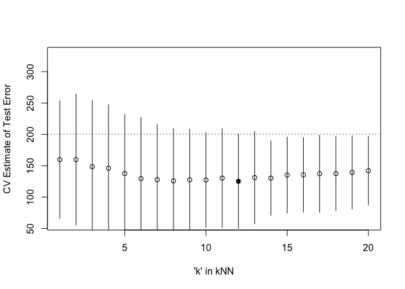<!-- -->

We will pick k = 20 because it is the most simplest and it’s median is
within one sd of the error of the least error model.
